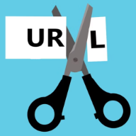

# URL Shortener
A simple PHP based URL Shortener.

## Implementation Demo
A "TheDoggyBrad" branded implementation can be found on https://url.x10.bz/
  
Note: The source code in this repository is not having any brandings, the name of the software in this repository is "URL Shortener" not "TheDoggyBrad URL Shortener".

## Features
✓Lightweight 
✓Easy access to database 
✓Immediately Ready to use (After File Upload to Server) 
✓No need for a database 
✓Fast Link Generation 
✓Easy to use 
✓No need for an account 
✓Almost all functions are performed on the server side 
✓Copy button for generated shortened URLs 
✓Privacy-Friendly 
✓Simply to use and implement 
✓Automatically prevents to generate a duplicate shortened code 

## Credits
✓OpenAI's ChatGPT for making the majority of this project's code. 
✓TheDoggyBrad for supervising and managing the development of this software

## How this works?
•.htaccess - This is a very crucial file, that makes every traffic redirect to redirect.php. 
•redirect.php - This file redirects the user to the shortened link (if that exists) or to the index.html file (if the shortened link does not exist). 
•index.html - This file is the User Interface, which uses shorten.php. This is where the Shortened URL is presented. 
•shorten.php - An essential file where the process of link generation happens and it saves the output on the urls.xml. 
•urls.xml - The most critical file, it is the database of all the links.

## Possible Security Concern Answered
The database is an xml file? Well, just change the permission to only the server will be the only one allowed to view that file (Disallow Public Viewing).
There will be no problems if the public cannot view the xml file because the redirection and link generation happens in the server side.  
Here's a proof! Visit https://url.x10.bz/urls.xml and you will see an HTTP error 403 instead of the actual xml file. Then visit https://url.x10.bz and try generating and visiting the shorten link. It works and even you cannot access the urls.xml file.

## Why an XML File as a database?
Well, XML is used for ease of speed and faster link deletion (if ever). And there will be no other problems about setting up a database anymore.

## How to implement this software on your server/hosting provider?
1.) Upload this whole Github Repository on your htdocs or public_html (other hosting providers uses other names) folder.
 
2.) If you are not uploading/implementing this on the root directory of your website or using your localhost. Please use modify the index.html, shorten.php and redirect.php files. The urls.xml file is not needed to be modified.
 
3.) Modify the software's UI and branding according to your needs and preferences.
 
4.) Test the software by going to https://whateveryoursiteis.com/directoryifever/test and it should redirect you to https://google.com, if not you may need to modify the files mentioned in step no.2
  
That's it, you have a now a lightweight, non-resource extensive url shortener.

## Licensing Agreement
This is an entirely open-source project and you can do whatever you want on it. You can sell, use, redistribute, patent, fork, modify, claim ownership or include it on your other software.
